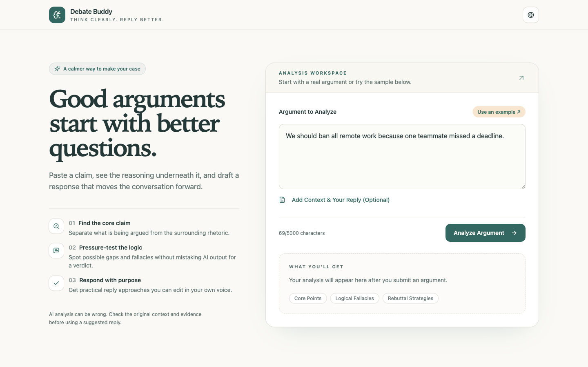

# Debate Buddy

**Think clearly. Reply better.** A bilingual workspace for examining an argument before responding to it.



Debate Buddy separates a claim into core points, flags *possible* reasoning gaps, and suggests editable reply strategies. You can add debate context and your own draft response so the analysis is grounded in the exchange you are actually having. The interface supports English and Chinese; the analysis language follows the argument you submit.

## What it does

| Input | Output |
| --- | --- |
| An argument, plus optional context and your reply | Core points, possible fallacies, practical rebuttal approaches, and an overall assessment |

The product is designed as a thinking aid, not an arbiter of who is right. AI can miss context, mislabel a fallacy, or produce a weak reply; check the source material and evidence before using its suggestions.

## Try it locally

Requires Node.js and npm:

```bash
git clone https://github.com/clarajzt/debate-buddy.git
cd debate-buddy
npm ci
npm run dev
```

Open the local URL printed by Vite. The interface and sample-input button work without a backend. Live analysis requires a configured Supabase project with the `analyze-argument` Edge Function deployed and a server-side `QWEN_API_KEY` secret. The browser uses the public `VITE_SUPABASE_URL` and `VITE_SUPABASE_PUBLISHABLE_KEY` values; never put the Qwen key in a `VITE_` variable or frontend file.

## How it works

```text
Browser (React / TypeScript)
  → Supabase Edge Function (request validation and prompt construction)
  → Qwen API (structured analysis)
  → Browser (core points, possible fallacies, reply strategies)
```

The Edge Function is in [`supabase/functions/analyze-argument`](supabase/functions/analyze-argument/index.ts). The UI is in [`src/pages/Index.tsx`](src/pages/Index.tsx). An unavailable or malformed model response is shown as an error, not as a fabricated analysis; the input remains in the editor for retry.

## Development checks

```bash
npm run build
npx tsc --noEmit -p tsconfig.app.json
npm run lint
```

Built with React, Vite, TypeScript, Tailwind CSS, shadcn/ui, Supabase Edge Functions, and Qwen. This is an actively developed prototype, not a validated fact-checking or debate-scoring system.
